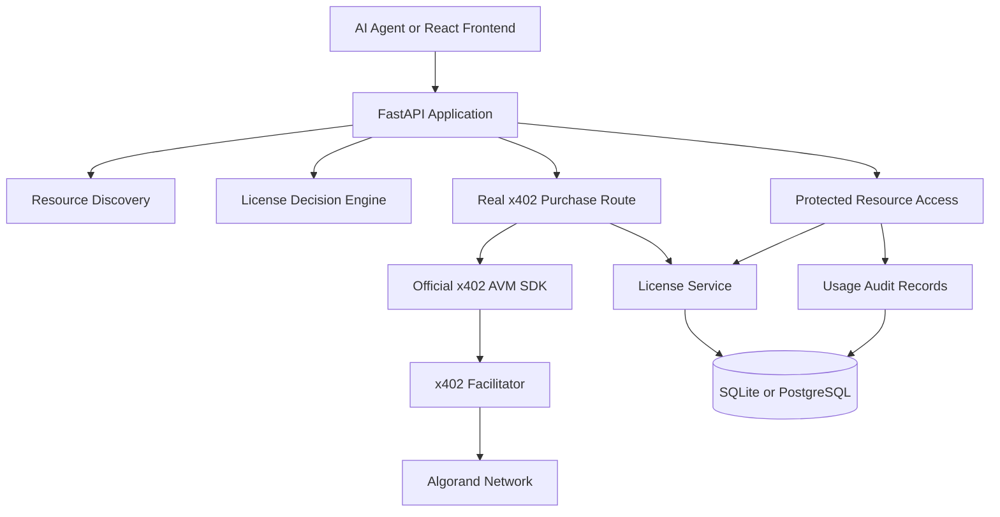

# AgentLicense Project Walkthrough

## 1. Project Purpose

AgentLicense is a machine-to-machine licensing marketplace for digital resources such as datasets, AI models, and APIs.

The intended workflow is:

1. Discover a resource.
2. Inspect its available license options.
3. Evaluate those options against an agent's requirements.
4. Pay for the selected license through x402 and Algorand USDC.
5. Issue a machine-readable license after successful settlement.
6. Enforce usage rights when the resource is accessed.
7. Record payment, provenance, and usage history.

## 2. Repository Structure

```text
Agent-license/
|-- README.md
|-- setup_windows.bat
|-- setup.sh
|-- docs/
|   |-- architecture.md
|   `-- walkthrough.md
|-- backend/
|   |-- requirements.txt
|   |-- app/
|   |   |-- main.py
|   |   |-- config.py
|   |   |-- models.py
|   |   |-- api/
|   |   |   |-- health.py
|   |   |   |-- resources.py
|   |   |   |-- licenses.py
|   |   |   |-- protected.py
|   |   |   |-- payments.py
|   |   |   `-- purchase.py
|   |   |-- agents/
|   |   |-- licensing/
|   |   |-- payments/
|   |   |-- blockchain/
|   |   |-- db/
|   |   `-- resources/
|   |-- scripts/
|   `-- tests/
`-- frontend/
    |-- index.html
    |-- package.json
    |-- vite.config.js
    `-- src/
        |-- main.jsx
        |-- app.jsx
        `-- index.css
```

## 3. Runtime Architecture



## 4. Backend Entry Point

The application is created in `backend/app/main.py`.

Startup behavior:

1. Load settings.
2. Configure logging.
3. Create the FastAPI application.
4. Add CORS middleware.
5. Add trusted-host middleware.
6. Initialize database tables.
7. Seed the demo resources.
8. Register API routers.

Registered routers are:

```text
GET  /health
GET  /resources
GET  /licenses
POST /x402/purchase/{tier}
GET  /x402/status
GET  /resources/{resource_id}/access
```

The root endpoint `/` returns application metadata and links to the main API areas.

## 5. Configuration

Configuration is implemented in `backend/app/config.py` using Pydantic Settings.

Important environment variables include:

```text
APP_ENV=development
DEBUG=true
DEMO_MODE=true
DATABASE_URL=sqlite:///./agentlicense.db
AVM_ADDRESS=<Algorand receiving address>
ALGORAND_NETWORK=testnet
ALGORAND_ALGOD_URL=https://testnet-api.algonode.cloud
ALGORAND_INDEXER_URL=https://testnet-idx.algonode.cloud
ALGORAND_ASSET_ID=10458941
X402_FACILITATOR_URL=https://x402.org/facilitator
```

The backend considers x402 configured when `AVM_ADDRESS`, the facilitator URL, and the Algorand network are present.

The default development database is SQLite. PostgreSQL can be used by changing `DATABASE_URL`.

## 6. Database Layer

Database setup is in `backend/app/db/database.py`.

The application uses SQLAlchemy with:

- `engine` for database connections.
- `SessionLocal` for sessions.
- `get_db()` as a FastAPI dependency.
- `Base.metadata.create_all()` for development schema creation.

The ORM models are in `backend/app/db/models.py`.

### Resource

Represents a digital asset that can be licensed.

Important fields:

- `id`
- `name`
- `description`
- `provider`
- `data`
- `created_at`

The `data` column stores JSON-serialized resource content.

### License

Represents the buyer's rights to a resource.

Important fields:

- `resource_id`
- `buyer`
- `seller`
- `price`
- `currency`
- `usage_limit`
- `uses_remaining`
- `commercial_use`
- `redistribution_allowed`
- `training_allowed`
- `expires_at`
- `status`
- `payment_reference`
- `algorand_tx_id`
- `license_hash`

### Payment

Stores payment and settlement audit information.

Important fields:

- `license_id`
- `amount`
- `currency`
- `network`
- `transaction_id`
- `status`
- `payment_method`
- `verified_at`

### LicenseUsage

Stores every successful resource access attempt.

Important fields:

- `license_id`
- `accessed_at`
- `access_method`
- `client_address`
- `success`
- `usage_metadata`

## 7. Resource Discovery

Resource endpoints are implemented in `backend/app/api/resources.py`.

The current demo resources are:

```text
market-dataset-001
nlp-model-002
api-access-003
```

Endpoints:

```text
GET /resources
GET /resources/{resource_id}
GET /resources/{resource_id}/licenses
GET /resources/{resource_id}/preview
```

Resources are seeded automatically during application startup. The license options are currently stored in the `DEMO_LICENSE_OPTIONS` constant rather than a database catalog.

Each license option contains:

- Price
- Currency
- Usage limit
- Duration
- Commercial-use permission
- Redistribution permission
- Training permission

## 8. Agent Decision Engine

The active decision engine is `backend/app/agents/decision_engine.py`.

The API schema is defined in `backend/app/models.py`.

An agent submits an `AgentRequirement` containing:

- Task description
- Budget
- Required uses
- Commercial-use requirement
- Redistribution requirement
- Training requirement
- Required duration

The engine evaluates every available option. An option is rejected when it:

- Has too few uses.
- Exceeds the budget.
- Lacks required commercial rights.
- Lacks redistribution rights.
- Lacks training rights.
- Does not meet the required duration.

If multiple options are compatible, the engine selects the lowest-priced one.

Endpoints:

```text
POST /licenses/{resource_id}/select
POST /licenses/{resource_id}/explain-selection
```

The normal selection response contains:

- `selected_license_id`
- `reason`
- `confidence`

The explanation response also contains an evaluation log showing why each option was accepted or rejected.

There is an older duplicate implementation in `backend/app/agents/agent.py`. The API currently imports `decision_engine.py`.

## 9. License Service

License business logic is implemented in `backend/app/licensing/license_service.py`.

Core functions are:

- `create_license()`
- `get_license()`
- `get_user_licenses()`
- `validate_license()`
- `consume_license_usage()`
- `generate_license_hash()`
- `verify_license_hash()`

When a license is created:

1. A unique license ID is generated.
2. Expiration is calculated if a duration is provided.
3. License terms are serialized in a deterministic order.
4. A SHA-256 hash is generated.
5. The license is stored with `ACTIVE` status.
6. `uses_remaining` is initialized from `usage_limit`.

License validation checks status, expiration, usage count, and requested permissions.

When usage is consumed, the remaining count is decremented and a `LicenseUsage` record is created. A license becomes `EXHAUSTED` when the count reaches zero.

## 10. License API

License endpoints are implemented in `backend/app/api/licenses.py`.

```text
GET  /licenses
GET  /licenses/{license_id}
GET  /licenses/{license_id}/verify
POST /licenses/{license_id}/consume
POST /licenses/{resource_id}/create-test-fixture
POST /licenses/{resource_id}/select
POST /licenses/{resource_id}/explain-selection
```

The test-fixture endpoint deliberately bypasses x402 and creates a simulated license for UI and backend testing. It must not be used in production.

## 11. Real x402 Payment Flow

The real payment path is implemented in:

- `backend/app/api/purchase.py`
- `backend/app/payments/x402_avm.py`

Supported tiers are:

| Tier | Price | Uses | Commercial use | Duration |
|---|---:|---:|---|---:|
| Single | $0.01 | 1 | No | None |
| Multi | $0.05 | 10 | No | 30 days |
| Commercial | $0.20 | 100 | Yes | 90 days |

The endpoint is:

```text
POST /x402/purchase/{tier}?resource_id={resource_id}
```

The request flow is:

1. Client sends the purchase request without payment.
2. The server returns HTTP 402 with x402 payment requirements.
3. The client selects the Algorand exact-payment scheme.
4. The client constructs an Algorand USDC transaction.
5. The connected wallet signs the transaction.
6. The client retries with `PAYMENT-SIGNATURE`.
7. The official x402 SDK verifies the payment with the facilitator.
8. The facilitator settles the transaction on Algorand.
9. The server creates a license only after successful settlement.
10. The transaction ID is stored on the license and payment records.
11. The server returns the issued license ID and provenance information.

The backend uses the official x402 AVM SDK components:

- `x402ResourceServer`
- `HTTPFacilitatorClient`
- `ExactAvmServerScheme`
- `x402HTTPResourceServer`
- `FastAPIAdapter`

Status endpoint:

```text
GET /x402/status
```

This reports the configured network, facilitator, receiving address state, and tier pricing.

## 12. Protected Resource Access

Protected access is implemented in `backend/app/api/protected.py`.

Endpoint:

```text
GET /resources/{resource_id}/access
```

The license ID may be supplied using either:

```text
license-id: <license_id>
x-license-id: <license_id>
```

The access flow is:

1. Find the resource.
2. Read the submitted license ID.
3. Return 402 if no license was supplied.
4. Find the license.
5. Validate status, expiration, usage, and permissions.
6. Confirm the license belongs to the requested resource.
7. Consume one license use.
8. Record the usage audit entry.
9. Return the resource data and remaining uses.

Responses:

```text
404 Resource does not exist
402 No AgentLicense license was supplied
403 License is invalid, expired, exhausted, or for another resource
200 Resource data returned successfully
```

The 402 response from this endpoint is an application-level license gate. It is not an x402 payment challenge. The actual x402 challenge is produced by `/x402/purchase/{tier}`.

## 13. Algorand Integration

Algorand integration is represented by `backend/app/blockchain/algorand.py`.

The class stores network, Algod, Indexer, receiving address, private key, and asset configuration.

In demo mode it creates clearly labeled simulated transaction IDs such as:

```text
DEMO_<hash>
```

In real mode, payment verification and settlement are performed by the x402 facilitator. The local `AlgorandClient` does not independently submit an arbitrary transaction or claim that an unverified transaction is valid.

The real payment architecture is therefore:

```text
Frontend wallet
  -> x402 client SDK
  -> AgentLicense x402 server
  -> x402 facilitator
  -> Algorand network
```

## 14. Frontend Architecture

The frontend is a React/Vite single-page application.

Important files:

- `frontend/src/main.jsx`: React entry point.
- `frontend/src/app.jsx`: Main application and workflow state.
- `frontend/src/index.css`: Global styling.
- `frontend/vite.config.js`: Vite and browser polyfill configuration.

The application contains these workflow views:

- Dashboard
- Marketplace
- Agent Decision
- Payment
- Success

Startup requests:

```text
GET /health
GET /resources
```

Resource selection requests:

```text
GET /resources/{resource_id}/licenses
```

Agent selection request:

```text
POST /licenses/{resource_id}/select
```

Real payment uses `wrapFetchWithPayment()` from the x402 frontend SDK. That wrapper handles the initial request, 402 response, wallet signing, payment header creation, and retry.

The frontend supports Pera and Defly wallets through `@txnlab/use-wallet-react`.

After a successful purchase, it accesses the resource through:

```text
GET /resources/{resource_id}/access
x-license-id: <license_id>
```

## 15. Current Implementation Gaps

### Legacy payments router

`backend/app/api/payments.py` defines `/payments/*` endpoints, but `payments.router` is not registered in `backend/app/main.py`. Those endpoints are not active in the current application.

### Demo payment inconsistency

When `VITE_DEMO_MODE=true`, the frontend creates a local simulated transaction and marks the purchase complete without creating a backend license. The local license option ID is not a database license ID, so protected access can fail afterward.

### Dependency declaration

The backend imports `x402` and `algosdk`, but the current `backend/requirements.txt` does not declare the x402 AVM package. Backend tests therefore fail during collection when those packages are unavailable.

### Empty modules

These modules are currently empty:

```text
backend/app/licensing/rights.py
backend/app/licensing/validator.py
backend/app/resources/resources_service.py
```

Their responsibilities are currently handled directly by API modules and `license_service.py`.

### Database migrations

Alembic is listed as a dependency, but migrations are not currently present. The application uses `create_all()`, which is suitable for development but not for controlled production schema changes.

### Production controls

For production, the application still needs authentication, buyer identity validation, purchase idempotency, duplicate-settlement protection, stronger payment amount and recipient checks, and transactional concurrency protection around usage consumption.

## 16. Running the Project

### Backend

```powershell
cd backend
python -m venv .venv
.venv\Scripts\Activate.ps1
pip install -r requirements.txt
python -m uvicorn app.main:app --host 0.0.0.0 --port 8000 --reload
```

Backend URLs:

```text
http://localhost:8000
http://localhost:8000/docs
http://localhost:8000/openapi.json
```

### Frontend

```powershell
cd frontend
npm install
npm run dev
```

The Vite development server normally runs at:

```text
http://localhost:5173
```

Set the backend URL with:

```text
VITE_API_URL=http://localhost:8000
```

## 17. Validation Status

The frontend production build currently succeeds with:

```text
npm run build
```

Backend test collection currently requires the missing Python dependencies for `x402` and `algosdk`. Once those packages are installed in the active virtual environment, run:

```powershell
cd backend
python -m pytest -q
```

## 18. Recommended Target Architecture

A production-oriented version should use these boundaries:

```text
API Routes
  -> Application Services
      -> Domain Policies
          -> Repository Interfaces
              -> Database

Payment Adapter
  -> Official x402 SDK
  -> Facilitator
  -> Algorand
```

Recommended improvements:

1. Move resources and license options into repositories.
2. Consolidate the duplicate agent engines.
3. Move rights validation into a dedicated policy service.
4. Decide whether the legacy `/payments` API should be removed or registered.
5. Make demo mode create licenses through the backend consistently.
6. Add x402 dependencies to `requirements.txt`.
7. Add Alembic migrations.
8. Add authentication and buyer identity checks.
9. Add purchase idempotency keys.
10. Prevent duplicate licenses after repeated settlement callbacks.
11. Protect usage decrement operations with transactions or row locking.
12. Move frontend API calls into dedicated service modules.

The implemented core is a FastAPI licensing service with SQLAlchemy persistence, a deterministic license-selection engine, official x402-Algorand payment integration, and database-backed usage enforcement. The main remaining work is production hardening and consistency between the demo and real payment workflows.
